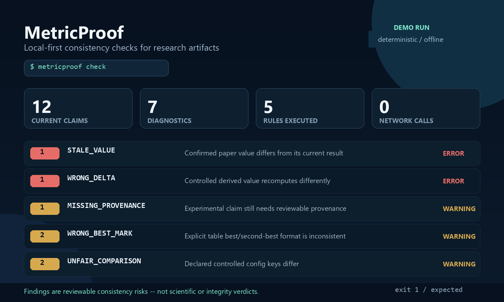

# MetricProof

**Deterministic, local-first consistency checks for experimental claims in research repositories.**

MetricProof connects numbers in LaTeX to declared JSON, YAML, or CSV experiment results and reports reviewable consistency risks. It runs locally, uses exact decimal arithmetic, never executes TeX or training code, and does not call an AI service.

> A MetricProof diagnostic is evidence of a representation mismatch or heuristic risk. It is not a verdict on scientific correctness, research integrity, or the validity of a conclusion.



## What it catches

| Rule | Question answered |
| --- | --- |
| `STALE_VALUE` | Does a confirmed paper value still agree with its experiment result? |
| `WRONG_DELTA` | Does a confirmed subtraction, relative change, mean, or standard deviation recompute correctly? |
| `MISSING_PROVENANCE` | Does an experimental-looking claim still need a link or an explicit ignore decision? |
| `WRONG_BEST_MARK` | Do configured table columns mark the best and optional second-best values consistently? |
| `UNFAIR_COMPARISON` | Do two declared runs differ on controlled configuration keys that were not explicitly allowed? |

Every user-visible rule diagnostic includes a stable ID, rule code, severity, confidence, source location, observed and expected facts, evidence, uncertainty, and remediation. Results are deterministically ordered and shared by terminal, JSON, and HTML renderers.

## Five-minute demo

Requirements: Python 3.13 and an editable install of this repository.

```powershell
py -3.13 -m venv .venv
.\.venv\Scripts\Activate.ps1
python -m pip install -e ".[dev]"
cd examples\mvp-demo
metricproof experiments validate
metricproof check
metricproof report --format html --output metricproof-report.html --no-timestamp
```

On Linux or macOS, activate with `source .venv/bin/activate` and use `cd examples/mvp-demo`.

The fictional Demo intentionally exits with code `1` for both `check` and `report`. That exit code means the configured rule threshold was met; the report is still written. Its stable findings exercise all five rules:

- one stale percentage;
- one incorrect percentage-point delta;
- one unlinked experimental claim;
- two incorrect table-format marks across higher- and lower-is-better columns;
- two unapproved controlled configuration differences.

Open `metricproof-report.html` in any modern browser. It is one offline file with inline CSS, no JavaScript, no external assets, and no network dependency. Use the checked-in [`run-demo.ps1`](examples/mvp-demo/run-demo.ps1) or [`run-demo.sh`](examples/mvp-demo/run-demo.sh) for the complete deterministic command sequence; both preserve the expected non-zero result rather than hiding it.

## Core workflow

```text
metricproof experiments validate
metricproof scan --show-claims
metricproof link --non-interactive --json
metricproof link
metricproof check
metricproof check --json
metricproof report --format html --output metricproof-report.html --no-timestamp
```

`scan` discovers review candidates without modifying project files. Non-interactive `link` ranks candidates and explains its evidence but never confirms a link. Interactive `link` writes only user-confirmed direct/derived links or explicit ignore decisions to `.metricproof/claims.yml`, using atomic replacement. `check` and `report` reload current inputs and never modify LaTeX, results, or experiment configurations.

Useful options:

```text
metricproof check --rule WRONG_BEST_MARK
metricproof check --rule UNFAIR_COMPARISON --fail-on warning
metricproof report --format json --output reports/check.json --no-timestamp
python -m metricproof check --help
python -m metricproof report --help
```

Exit codes are stable:

- `0`: completed below the selected rule threshold;
- `1`: rule findings met the selected threshold;
- `2`: CLI usage or project configuration error;
- `3`: blocking input, parse, or link diagnostic.

## Minimal project configuration

Create `.metricproof/config.yml`. All paths are project-relative and boundary checked.

```yaml
schema_version: "1"
claim_registry_path: .metricproof/claims.yml
paper_paths:
  - paper/main.tex
result_paths:
  - path: runs/baseline.yml
    format: yaml
    run_id: baseline
    config_reference: configs/baseline.yml
    structured:
      metrics:
        accuracy: metrics.accuracy
        error_rate: metrics.error_rate
  - path: runs/candidate.yml
    format: yaml
    run_id: candidate
    config_reference: configs/candidate.yml
    structured:
      metrics:
        accuracy: metrics.accuracy
        error_rate: metrics.error_rate
metric_directions:
  accuracy: higher
  error_rate: lower
table_checks:
  - table: tab:main-results
    header_row: 0
    data_start_row: 1
    label_column: 0
    metric_columns:
      - {column: 1, metric: accuracy}
      - {column: 2, metric: error_rate}
    best_format: bold
    second_best_format: underline
    tie_tolerance: "0.0001"
comparisons:
  - comparison_id: baseline-vs-candidate
    baseline_run: baseline
    candidate_run: candidate
    controlled_keys:
      - dataset.split
      - evaluation.script_version
      - training.epochs
    allowed_differences: {}
    severity: warning
```

Table semantics are explicit: MetricProof does not guess headers, metric direction, data rows, or whether bold/underline means best/second-best. Ties within the configured decimal tolerance share the same expected mark. Only parsed, single-valued cells participate; missing cells are skipped, and unsupported/degraded structure is surfaced as a limitation rather than guessed.

Comparison semantics are also explicit. MetricProof reads only the declared dot-path keys from each run's local JSON/YAML `config_reference`. It compares exact types and values, with optional per-key absolute/relative decimal tolerances. A difference is quiet only when listed in `allowed_differences` with a non-empty reason. This is a controlled-configuration risk check, not a fairness or scientific-validity verdict.

For complete configuration and semantics, see [`docs/rule-semantics.md`](docs/rule-semantics.md), [`docs/linking-and-checking.md`](docs/linking-and-checking.md), and [`docs/html-report.md`](docs/html-report.md).

## Supported inputs and safety

MetricProof v0 reads only:

- controlled LaTeX source graphs rooted at exact configured `.tex` files;
- declared local JSON, YAML, and CSV experiment results;
- declared local JSON/YAML experiment configuration snapshots;
- optional local Git metadata for the existing read-only `doctor` boundary.

Safety properties:

- YAML uses safe loading and rejects unsafe tags, duplicate keys, and multiple documents.
- JSON rejects duplicate keys and non-finite constants.
- Numeric parsing uses lexical `Decimal`, not binary floating-point equality.
- Absolute paths, `..` traversal, missing targets, duplicate aliases, and symlink escapes are rejected.
- MetricProof never runs TeX, Python, training scripts, user expressions, or shell commands.
- No database, server, account, network service, AI API, LLM, or embedding model is used.
- Generated HTML escapes user-controlled content and contains no script or remote resource.

Basic `table`/`tabular` structures, `\multicolumn`, `\textbf`, `\underline`, and booktabs markers are supported. Dynamic macro expansion, `multirow` semantics, complex cross-row cells, `longtable`, `tabularx`, arrays/matrices, and full TeX interpretation are not. Unsupported structure produces controlled limitations and is never promoted to a high-confidence best-mark conclusion.

Built-in resource limits bound file size, graph size/depth, result sources, CSV rows, tables, cells, cell size, and candidates. See [`SPEC.md`](SPEC.md) for the exact product boundary.

## Development

```text
python -m pytest
python -m pytest --cov=metricproof --cov-report=term-missing
python -m ruff check .
python -m ruff format --check .
pyright
python -m build
```

For an offline environment with build dependencies already installed, use `python -m build --no-isolation`.

The code uses a Python 3.13 `src` layout and keeps dependencies directed as `cli -> application -> domain`, with adapters implementing application ports. Rules are pure functions over prepared domain objects; report renderers consume `CheckResult` and do not reimplement rule decisions.

## Deliberate non-goals

The current release does **not** include Git evidence chains, GitHub Actions integration, SARIF, PDF/Word parsing, online Overleaf access, remote repositories, cloud services, a Web UI, databases, plugins, AI/LLM integration, experiment execution, TeX compilation, or automatic paper fixes. It also does not infer scientific quality, misconduct, causal validity, or whether a comparison is publishable.

See [`docs/status.md`](docs/status.md) for verified implementation status and known limits. MetricProof is Apache-2.0 licensed.